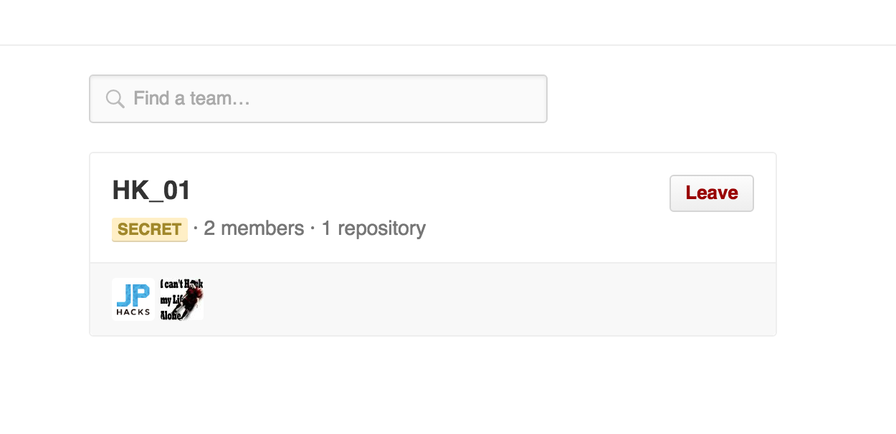

# プロダクト開発・提出方法
JPHACKSでは参加者の方々がより開発に時間を費やし、質の高いプロダクト開発をサポートするために、GitHubを活用し、作品情報の提出を実施しております。

## 前提条件
- Slack、GitHubの登録が完了、ログインしている状態であることを前提として、開発から提出方法を記載いたします。
- JPHACKSではGitHubを活用した製品開発を推奨し、GitHubを活用した製品情報の提出がオンライン一次審査では必須となっておりますので、以下の流れに従ってソース・コードを正しく提出されることを強く推奨します。詳細は[審査方法](criteria.md)を御覧ください。  

## 開発開始から作品提出の流れ
### Hack Day前：
1. [GitHub の JPHACKS organization からメンバー招待の確認と承認](#section1)
2. [チームリポジトリの確認](#section2)

### Hack Day当日：
3. [最終的に開発したプロダクトの登録・README.mdの記入](#section3)
4. [提出フォームによるプロダクト情報の最終提出](#section4)

## <a name="section1">1. GitHub の JPHACKS organization からメンバー招待の確認と承認</a>

#### 1-1. 招待メールの確認
申請したメールアドレスに、以下の招待メールが届いていることを確認し、本文中段のリンクをクリックし、招待の確認をします。  
文中の `shota nitta` や `maximum80` は GitHub で登録されている氏名・ユーザ名になります。
```
Hi shota nitta,

JPHACKSサポートアカウント has invited you to join the JPHACKS organization on GitHub. Head over to https://github.com/jphacks to check out JPHACKS's profile.

To join JPHACKS, follow this link:

https://github.com/orgs/jphacks/invitation?via_email=1

Some helpful tips:

- If you get a 404 page, make sure you’re signed in as maximum80.
- You can also accept the invitation by visiting the organization page directly at https://github.com/jphacks

If you were not expecting this invitation, you can ignore this email.

Thanks,
The GitHub Team
```

#### 1-2. チーム招待の承認


招待のURLにアクセスすると、上記のようなJPHACKS組織委員会からの招待を確認できます。  
"JOIN JPHACKS"のボタンをクリックして、チームの招待を承認してください。

## <a name="section2">2. チームリポジトリの確認</a>

#### 2-1. チームIDの確認
承認して、JPHACKSの組織に所属したら、[チームページ](https://github.com/orgs/jphacks/teams)にアクセスしてください。
以下のように所属しているチームを閲覧することが出来ます。



```
会場ID_年度IDチームID
```

が記載された、チームが表示されています。
表示されているIDがみなさんの今回のチームIDになりますので、ご確認ください。

#### 会場ID
* 札幌：SP
* 仙台：SD
* 東京：TK
* 名古屋：NG
* 神戸：KB
* 福岡：FK
* 沖縄：ON

#### 年度ID
* 2019年度開催は"19"が頭に入ります。

#### チームID：0
- 1~35まで

* 例)北海道会場の01番のチーム
```
HK_1901
```

#### 2-2. チームリポジトリの確認

自身のチームを確認できたら、そのページからチームIDをクリックしてください。
以下のチームの詳細ページが表示されます。


表示されたら、 **Repository** をクリックしてください。


表示されたリポジトリが今回皆様にご利用いただくリポジトリとなります。

リポジトリ内に
* README.md
  * 最終提出に必要な項目の記載されたファイル
* LICENSE
  * ライセンスファイル

が既に保存されている事を確認してください。

以下のような画面が表示されれば問題ございません。


## <a name="section3">3. 最終的に開発したプロダクトの登録・README.mdの記入</a>
- Hack Dayの最終提出用のプロダクト概要として、README.mdの記入をフォーマットに合わせて更新してください。
- README.mdには、必ず「デモ動画のリンク」及び「作品情報」が含まれているようにしてください。

## <a name="section4">4. 提出フォームによるプロダクト情報の最終提出</a>
* [プロダクト提出フォーム](https://forms.gle/Rk6d4iua7sR8hW4P6)にアクセスし、必要事項を記入します。
* チーム決定時に配布されている、会場ID・チームIDを入力してください。
* GitHubのプロジェクトURLを記入してください。
  * GitHub以外のURLは受け付けておりませんので、ご注意ください。

## 注意事項
* 一度プロダクト情報を提出された場合、再提出はできませんのでご注意下さい。
* Hack Dayのプロダクト提出終了時刻までに、不慮の事態を除き提出が遅れた場合は、提出が認められない場合がございます。予めご了承下さい。

## GitHubについて
- チームメンバーとGitHubを使おう
  * チームのメンバーとGitHubを活用して共同で開発を進める場合は。リポジトリの設定（リポジトリページ > settings > Collaborators & teams > Collabrater）にて、開発メンバーを追加して開発することを推奨します。
* GitHub、Gitによるプロダクトのバージョン管理がわからないチームは、事前に[Git,GitHubの使い方](how-to-use-git-github.md)などを参照し、使い方を習得することを推奨します。
  * 運営側でもGitHubの使い方については、Slackのチャンネル上でフォローアップをする予定です。
