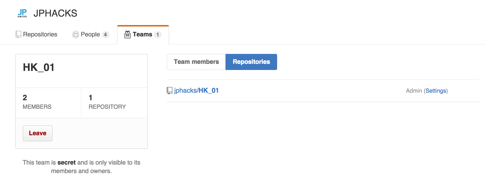

# プロダクト開発・提出方法
JPHACKSでは参加者の方々がより開発に時間を費やし、質の高いプロダクト開発をサポートするために、GitHub、DEVPOSTという外部サービスを活用し、作品情報の提出を実施しております。

## ガイダンス動画
<iframe width="560" height="315" src="https://abemafresh.tv/embed/53636" frameborder="0" allowfullscreen></iframe>

## 前提条件
- Slack、GitHub、DEVPOSTの登録が完了、ログインしている状態であることを前提として、開発から提出方法を記載いたします。
- JPHACKSではGitHubを活用した製品開発を推奨し、GitHubを活用したソース・コード提出が**技術審査項目**の大きなウェイトを占めておりますので、以下の流れに従ってソース・コードを正しく提出されることを強く推奨します。詳細は[審査方法](how-to-judge.md)を御覧ください。  

## 開発開始から作品提出の流れ
### HackDay前：
1. [GitHub の JPHACKS organization からメンバー招待の確認と承認](#section1)
2. [チームリポジトリの確認](#section2)
3. [リポジトリの設定(公開か非公開かの設定)](#section3)
4. [(任意)開発プロダクトの概要登録・README-before.mdの完成](#section4)

### HackDay当日：
5. [最終的に開発したプロダクトの登録・README.mdの記入](#section5)
6. [DEVPOSTへの登録・作品の最終提出](#section6)
7. [提出フォームによるプロダクト情報の最終提出](#section7)

## <a name="section1">1. GitHub の JPHACKS organization からメンバー招待の確認と承認</a>

#### 1-1. 招待メールの確認
申請したメールアドレスに、以下の招待メールが届いていることを確認し、本文中段のリンクをクリックし、招待の確認をします。  
文中の `akihiro nitta` や `maximum80` は GitHub で登録されている氏名・ユーザ名になります。
```
Hi akihiro nitta,

JPHACKSサポートアカウント has invited you to join the JPHACKS organization on GitHub. Head over to https://github.com/jphacks to check out JPHACKS's profile.

To join JPHACKS, follow this link:

https://github.com/orgs/jphacks/invitation?via_email=1

Some helpful tips:

- If you get a 404 page, make sure you’re signed in as maximum80.
- You can also accept the invitation by visiting the organization page directly at https://github.com/jphacks

If you were not expecting this invitation, you can ignore this email.

Thanks,
The GitHub Team
```

#### 1-2. チーム招待の承認

招待のURLにアクセスすると、上記のようなJPHACKS実行委員会からの招待を確認できます。  
"JOIN JPHACKS"のボタンをクリックして、チームの招待を承認してください。

## <a name="section2">2. チームリポジトリの確認</a>

#### 2-1. チームIDの確認
承認して、JPHACKSの組織に所属したら、[チームページ](https://github.com/orgs/jphacks/teams)にアクセスしてください。
以下のように所属しているチームを閲覧することが出来ます。


```
会場ID_年度IDチームID
```
が記載された、チームが表示されています。
表示されているIDがみなさんの今回のチームIDになりますので、ご確認ください。
* 会場ID
 * 北海道：HK
 * 東北：TH
 * 東京：TK
 * 名古屋：NG
 * 神戸：KB
 * 九州：KS
* 年度ID
 * 2016年度開催は"16"が頭に入ります。
* チームID：01~35まで

* 例)北海道会場の01番のチーム
```
HK_1601
```

#### 2-2. チームリポジトリの確認

自身のチームを確認できたら、そのページからチームIDをクリックしてください。
以下のチームの詳細ページが表示されます。


表示されたら、**Repository**をクリックしてください。



表示されたリポジトリが今回皆様にご利用いただくリポジトリとなります。

リポジトリ内に
* README-before.md
  * HackDayよりも前に企画・開発した内容等の必要な項目の記載されたファイル
* README.md
  * 最終提出に必要な項目の記載されたファイル
* LICENSE
  * ライセンスファイル

が既に保存されている事を確認してください。

以下のような画面が表示されれば問題ございません。


## <a name="section2">3. リポジトリの設定(公開か非公開かの設定)</a>

参加者はプロダクトライセンスの異なる以下の2つの開発手法を選択することが出来ます。

#### 3-1. オープンソースプロジェクトとして開発する
オープンソースプロジェクトとして開発をする場合、ソースコードはOSSとして一般に公開されます。
またJPHACKSではMITライセンスの適用を推奨しております。既に指定のファイルの保存や設定はされているので、[コチラ](#section4)をクリックして次のステップに移動してください。

- オープンソースの開発のメリットとしては、共同編集者による支援が獲得出来る可能性がある点、DEVPOSTへの提出が安易になる等がございますが、反面「プロダクト情報を公開する」という点がございます。[開発ルール](rule.md)にも記載のある通り、JPHACKS実行委員会では、もし著作権や知的財産権その他の権利を侵害する行為があった場合においても、一切の責任は負いかねますので、プロダクト情報を良くお確かめの上、公開非公開の選択をしていただきますようお願い致します。

#### 3-2. プライベートリポジトリを活用して開発する
プロジェクトのソースコードを非公開にしたい場合は、GitHubのプライベートリポジトリを活用します。
リポジトリをプライベートにするためには、以下の方法に従ってください。  

- また、プロダクト情報を公開したくない場合は、必ずプロダクト情報をpushする前にリポジトリをプライベートににするようにお気をつけ下さい。
画面右側のSettingsをクリックして、設定ページに移動してください。


* ページ下部の**DangerZone**にある**Make Private**ボタンをクリックしてください。
* モーダルが立ち上がりますので、リポジトリ名を入力し、**I understand,make this repository private**を 選択してください。

設定が完了すると以下のように、リポジトリ名のとなりに、**"Private"**が表示されていれば、設定は完了です。


## <a name="section4">4. (任意)開発予定プロダクトの登録・README-before.mdの完成</a>
- 今回のJPHACKSでは、10月17日(水)より開発を開始することが出来ます。
- ただし、HackDay以前に企画や開発した内容・HackDayにて最終的に提出した内容をみるために、HackDay事前提出用のドキュメントファイル(README-before.md)、HackDay最終提出用のファイル(README.md)の二つのファイルの記入と提出をお願いしております。
- HackDayよりも前に企画・開発を進める場合は、必ずフォーマットに従い、README-before.mdの記入と更新をするようにお願いします。

## <a name="section5">5. 最終的に開発したプロダクトの登録・README.mdの記入</a>
- HackDayの最終提出用のプロダクト概要として、README.mdの記入をフォーマットに合わせて更新してください。
* 完成形のイメージとして、[サンプル](https://github.com/jphacks/sample/tree/tum-music/README.md)をご参照ください。

## <a name="section6">6. DEVPOSTへの作品情報の登録</a>
### 6-1. オープンソースプロジェクトの場合
* 今回作成したプロダクトを代表者一名がforkしてください。


* リポジトリのページの右上のforkボタンをクリックします

* 次にDEVPOST上の [プロジェクトの登録ページ](http://devpost.com/software/)にアクセスしてください。
* GitHubリポジトリのインポートを選択し、今回作成したプロダクトのリポジトリを指定し、インポートをしてください。
* 登録の詳細ページに、入力事項を埋めて、登録を完了してください。
* **[必須]GitHubのURLは提出が必須となります。URLが記入されているかどうか、かならずお確かめ下さい。**
* **[必須]デモ動画など、プロダクトのUI/UXがわかるものを登録してください。**
  - デモ動画は[ニコニコ動画](http://www.nicovideo.jp/)、[Youtube](https://youtube.com/)、[Vimeo](https://vimeo.com/)等にアップロードして、アップロード先のURLを登録します。

* 完成形のイメージとして、[サンプル](http://devpost.com/software/tum-music)をご参照ください。

### 6-2. プライベートリポジトリの場合
* [プロジェクトの登録ページ](http://devpost.com/software/)にアクセスしてください。
* 今回作成したプロジェクトの情報を登録してください。
  * 今回作成したリポジトリのREADME.md([サンプル](https://github.com/jphacks/sample/blame/master/README.md))にアクセスし、コピーをしてください。
  * "Here's the whole story"の部分には、かならずREADME.mdと同じ内容のフォーマットにて、プロダクト情報を登録してください。
* 登録の詳細ページに、入力事項を埋めて、登録を完了してください。
* **[必須]GitHubのURLは提出が必須となります。URLが記入されているかどうか、かならずお確かめ下さい。**
* **[必須]デモ動画など、プロダクトの概要がわかるものを登録してください。**

* 完成形のイメージとして、[サンプル](http://devpost.com/software/tum-music)をご参照ください。

## <a name="section7">7. 提出フォームによるプロダクト情報の最終提出</a>
* [プロダクト提出フォーム](https://goo.gl/forms/5DSoo4TOkPNSIDrJ2)にアクセスし、必要事項を記入します。
* チーム決定時に配布されている、会場ID・チームIDを入力してください。
* [6. DEVPOSTへの作品情報の登録](#section6)で登録をしたDEVPOSTのプロジェクトURLを記入してください。
  * DEVPOST以外のURLは受け付けておりませんので、ご注意ください。

## 注意事項
* 一度プロダクト情報を提出された場合、再びの提出はできませんのでご注意下さい。
* HackDayのプロダクト提出終了時刻までに、不慮の事態を除き提出が遅れた場合は、提出が認められない場合がございます。予めご了承下さい。

## GitHubについて
- チームメンバーとGitHubを使おう
  * チームのメンバーとGitHubを活用して共同で開発を進める場合は。リポジトリの設定（リポジトリページ > settings > Collaborators & teams > Collabrater）にて、開発メンバーを追加して開発することを推奨します。
* GitHub、Gitによるプロダクトのバージョン管理がわからないチームは、事前に[Git,GitHubの使い方](../documents/how-to-use-git-github.md)などを参照し、使い方を習得することを推奨します。
  * 運営側でもGitHubの使い方については、Slackのチャンネル上でフォローアップをする予定です。

## 提出必須物の確認表
HackDayの最終的なフォーム提出前に、DEVPOST上のプロジェクト内容に、以下の項目が全て当てはまっているか、かならずご確認ください。  

- [ ] GitHubリポジトリのURLが記入されている
- [ ] プロダクト概要が、運営が提供するフォーマット[README.md](https://github.com/jphacks/sample/blame/master/README.md)と同様である
- [ ] DEMO動画が正しく再生することができている

--------------
[[目次へ戻る](../README.md)] [[審査基準へ](criteria.md)]

----
JPHACKS実行委員会
